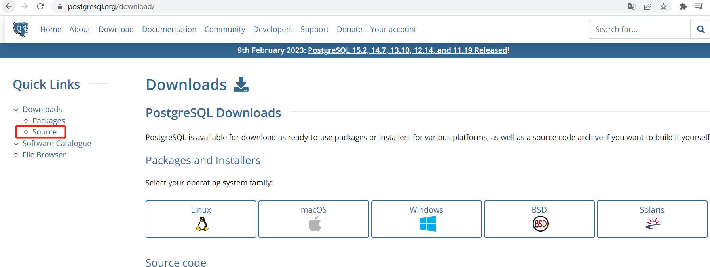
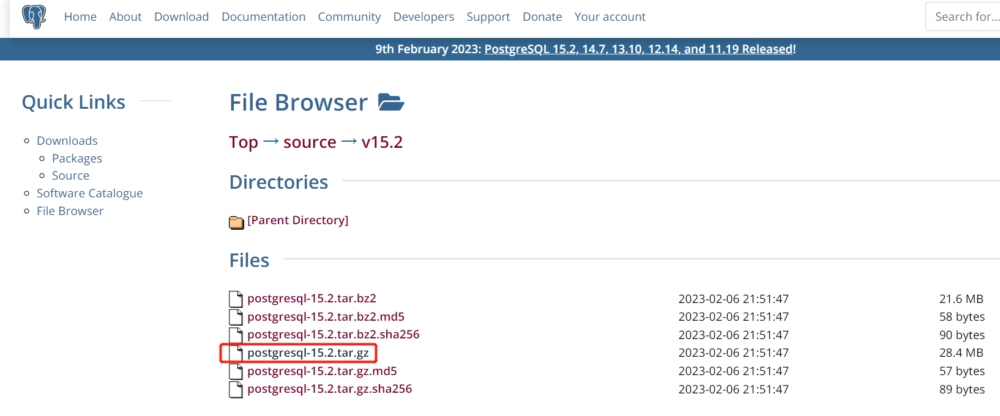
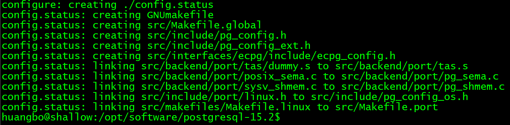
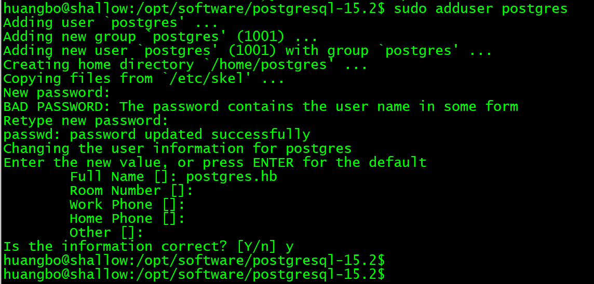
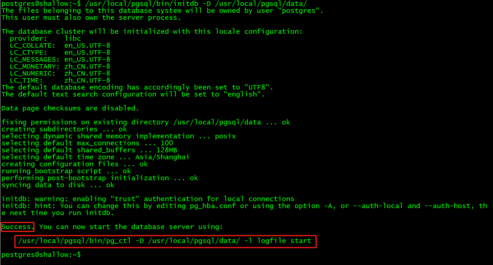
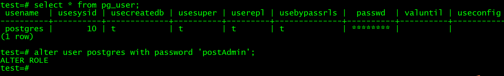
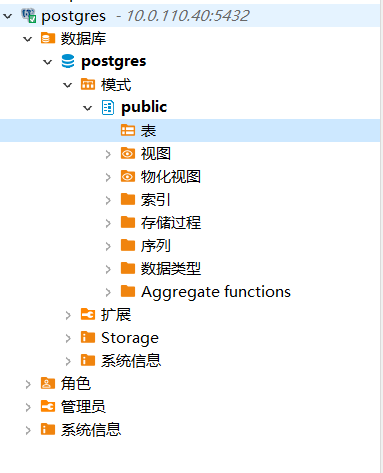
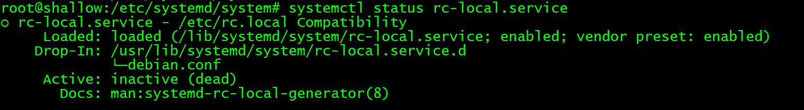

# 下载源码安装包
进入[PostgreSQL官网](https://www.postgresql.org/), 选择`download`  




# 环境准备
## C编译器
PostgreSql是用C语言写的，编译源码需要服务器具有C编译器，详细信息可以查看[官方手册](https://www.postgresql.org/docs/)  
安装GCC  
`sudo apt-get install gcc`  
若想安装指定版本，需要查询软件,可以使用如下命令  
`sudo apt-cache search <pkgName>`  
安装指定版本    
`sudo apt-get install <pkgName>=<version>`  

## readline 库
执行 `configure` 需要 readline 库  
readline 使 pg 数据库能记住用户的命令历史  
```shell
sudo apt-get install lib64readline-dev
sudo apt install libreadline-dev
```

## zlib
若不适用zlib进行编译， 则 pg_dump 和 pg_restore 的文档压缩功能将失效  
`apt-get install zlib1g zlib1g-dev`

## make 工具
编译工作使用的 Makefile , 因此需要 **make** 工具  
官方手册要求 make版本 &gt; 3.8.1  
`sudo apt-get install make`

# 安装
将源码包上传至服务器并解压   

## configure 
如果出现 `creating makefile` 字样，则说明 configure 成功啦  
 
    

## make & make install 
make install 会在 `/usr/local` 下面创建 `pgsql` 文件夹, 因此需要 root 权限  
`sudo make & sudo make install`


# 初始化、启动数据库
## 创建用户 postgres 
`sudo adduser postgres`

  

## 创建 data 目录, 并更改目录归属
`sudo mkdir /usr/local/pgsql/data`  
`sudo chown -R postgres. /usr/local/pgsql/data`  

## 切换至 postgres 用户
`su - postgres`

## 初始化数据库
`/usr/local/pgsql/bin/initdb -D /usr/local/pgsql/data/`  



## 启动数据库
`/usr/local/pgsql/bin/pg_ctl -D /usr/local/pgsql/data/ -l logfile start`  


## 创建数据库 test
`/usr/local/pgsql/bin/createdb test`  

## 修改默认用户 postgres 的密码
连接数据库 test  
`/usr/local/pgsql/bin/psql test`  
修改密码  




## 客户端连接数据库
开启防火墙端口号  
```
sudo ufw allow 5432
```

数据库默认配置是只能服务器本机能进行连接，可以通过配置文件 `data` 目录下的 `pg_hba.conf` 和 `postgresql.conf` 进行配置  

修改 `pg_hba.conf` 配置  
```
# 添加 host 配置行， 下面这行表示 允许 10.0.110.1 的ip地址可以访问 PostgreSql 的所有数据库
host    all             all             10.0.110.1/32            md5
```
修改 `postgresql.conf` 配置  
```
# 配置监听所有ip地址
listen_addresses = '*'
```

修改配置文件后，重启数据库服务  
` /usr/local/pgsql/bin/pg_ctl -D /usr/local/pgsql/data/ -l logfile restart`


若是只修改了 `postgresql.conf` 文件中的某些项，可以通过如下指令让配置生效  
`./pg_ctl reload -D /usr/local/pgsql/data/`


使用 dbeaver 进行远程连接  




# 设置开机启动
## Ubuntu 22.04 设置开机启动  
设置开机启动的方式：  
>可以直接在 `/etc/systemd/system` 目录下编写服务启动脚本, 然后通过 `systemctl` 命令启动服务    
>先开启系统的`rc-local.service`服务，然后通过创建`/etc/rc.local`文件来设置开机启动服务  

**rc-local.service** 是系统自带的一个开机服务，但是在 Ubuntu 22.04 版本下默认没有开启  
### 开启 rc-local.service 
修改 /lib/systemd/system/rc-local.service 文件  
```shell
#  SPDX-License-Identifier: LGPL-2.1-or-later
#
#  This file is part of systemd.
#
#  systemd is free software; you can redistribute it and/or modify it
#  under the terms of the GNU Lesser General Public License as published by
#  the Free Software Foundation; either version 2.1 of the License, or
#  (at your option) any later version.

# This unit gets pulled automatically into multi-user.target by
# systemd-rc-local-generator if /etc/rc.local is executable.
[Unit]
Description=/etc/rc.local Compatibility
Documentation=man:systemd-rc-local-generator(8)
ConditionFileIsExecutable=/etc/rc.local
After=network.target

[Service]
Type=forking
ExecStart=/etc/rc.local start
TimeoutSec=0
RemainAfterExit=yes
GuessMainPID=no

# 添加Install, 注意首字母一定要大写
[Install]
WantedBy=multi-user.target
Alias=rc-local.service

```  

### 新增 /etc/rc.local 文件  
系统默认是没有 **/etc/rc.local** 文件的, 需要自己手动创建  
```shell
#!/bin/sh

echo "----------- 开启手动配置的服务 -----------------" > /home/huangbo/service.log 

# 设置 pgsql 开机启动
su - postgres -c "sh /usr/local/pgsql/bin/start.sh"
```  

### 修改 /etc/rc.local 文件权限
创建的文件默认没有执行权限，可以对所有用户加上执行权限  
```shell
chmod a+x /etc/rc.local
```  
### 启动 rc-local.service  
```shell
systemctl enable rc-local.service
```  
  

**看服务启动信息，其实就是创建了两个软连接**  

### 查看服务状态  
```shell
systemctl status rc-local.service
```  
  


### 重启服务器，验证 /etc/rc.local 是否会被正确加载  
启动好 rc-local.service 服务后，它就可以自动加载 /etc/rc.local 到开机启动服务里去了  
`reboot`  

我们在 /etc/rc.local 文件中加入了启动日志  
  

**以上，开启自动启动服务正常工作**  


