# 安装 vsftpd 服务
```bash
# 使用如下命令查看是否安装了 vsftpd 服务
systemctl status vsftpd.service
```
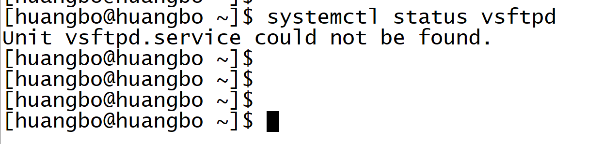  
```bash
# 切换至root用户，安装 vsftpd 服务
yum install vsftpd
```
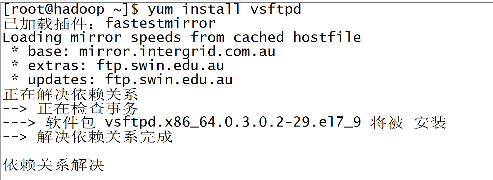

# 配置 vsftpd 服务
## 1. 简易版
### 1.1 简单配置 vsftpd.conf
安装`vsftpd`服务后, 在 `/etc/vsftpd/` 目录下有相关的服务配置文件  
我们若想简单使用 `ftp` 服务，那么稍微修改下 `vsftpd.conf` 文件就可以了
直接打开 `vsftpd.conf` 文件，添加如下配置项：  
```properties
pasv_min_port=6000
pasv_max_port=6100
```
### 1.2 修改防火墙规则
因为 `ftp` 服务在进行`TCP`连接时，需要用到端口，因此要想正常连接和传输数据，需要将对应的端口打开
**在防火墙里添加服务规则有2种方式: a) 直接将服务添加进防火墙规则分区 b)将服务的指定端口协议加入防火墙**  
**任选一种配置都可以使ftp能够正常连接** 
#### 1.2.1 防火墙命令简介
`RHEL7` 系统开始使用命令 `firewall-cmd`对防火墙进行配置，若是`RHEL6`或更早期版本，需要查阅 `iptables`命令
`firewall-cmd`常用命令：
```shell
# 查看 firewalld 服务状态
firewall-cmd --state
# 查看帮助
firewall-cmd -h
# 查看所有分区
firewall-cmd --get-zones
# 查看当前激活的分区
firewall-cmd --get-active-zone
# 查看 public 分区添加的服务
firewall-cmd --list-services --zone=public
# 查看 public 分区添加的端口
firewall-cmd --list-ports --zone=public
# 向分区 public 添加服务, 永久生效(--permanent)
firewall-cmd --zone=public --add-service=<service_name> --permanent
# 移除服务
firewall-cmd --zone=public --remove-service=<service_name> --permanent
# 向分区 public 添加tcp协议端口, 永久生效(--permanent)
firewall-cmd --zone=public --add-port=21/tcp --permanent
firewall-cmd --zone=public --add-port=8000-9000/tcp --permanent
# 移除端口
firewall-cmd --zone=public --remove-port=21/tcp --permanent
# 刷新防火墙规则， 所有配置修改后需要刷新才能生效
firewall-cmd --reload
```
#### 1.2.2 直接将 ftp 服务加入防火墙
```shell
# 永久添加 ftp 服务
firewall-cmd --zone=public --add-service=ftp --permanent
# 刷新防火墙规则
firewall-cmd --reload
# 查看分区中的已添加的服务
firewall-cmd --zone=public --list-services
```
#### 1.2.3 将指定端口加入防火墙规则
```shell
# 永久添加端口, 这里需要添加2种端口，一种是进行ftp连接的21端口, 一种是用于数据传输的高端口(如果是被动模式的话)
firewall-cmd --zone=public --add-port=21/tcp --permanent
# 假设 pasv_min_port 和 pasv_max_port 设置的端口范围为 5000-5100
firewall-cmd --zone=public --add-port=5000-5100/tcp --permanent
# 刷新规则
firewall-cmd --reload
# 查看已开放的端口
firewall-cmd --zone=public --list-ports
```
### 1.3 启动vsftpd服务，用客户端进行连接
```shell
# 启动服务
systemctl start vsftpd.service
# 查看服务状态
systemctl status vsftpd.service
# 重启服务
systemctl restart vsftpd.service
```
当服务正常启动后就可以通过客户端进行连接了：  

**Windows 进行ftp连接:**
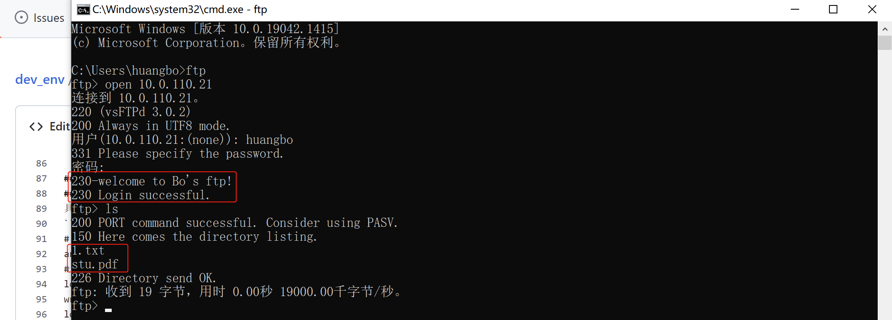  

**其他Linux机器连接ftp服务：**  
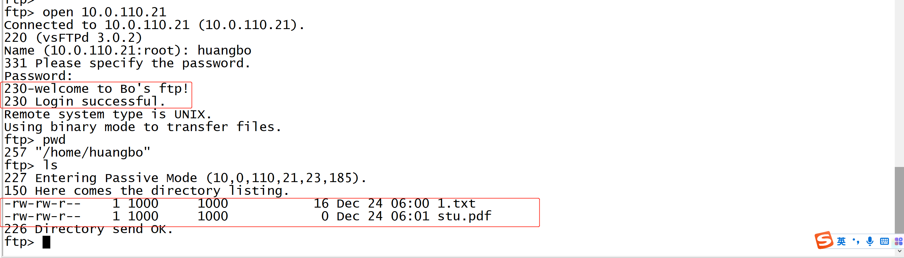  

上述连接时的欢迎语是因为我在登录用户的主目录下创建了一个`.message`文件，并在文件中加入了欢迎语内容: `welcome to Bo's ftp!`  
**注意：如果只是想简单使用`ftp`服务，而不怎么在意安全问题，那么简易版就行了，但是若想使用更安全的ftp服务或者更精细化的控制用户权限，比如只允许上传或者只允许下载等，可以细化配置。下面要介绍的精修版可以很好的控制各种权限**

## 2. 精修版
### 2.1 修改配置文件 vsftpd.conf
具体配置项信息可以参考当前目录下的 vsftpd.conf.properties 文件或者 在linux服务器上通过 man vsftpd.conf 查看 manual
```properties
# 禁止匿名用户登录
anonymous_enable=NO
# 本地用户可以登录
local_enable=YES
write_enable=YES
local_umask=022
dirmessage_enable=YES
# 开启登录、上传、下载的日志记录文件
xferlog_enable=YES
# 日志格式
xferlog_std_format=YES
# chroot_list 文件中的登录用户可以切换至其他目录
chroot_local_user=YES
chroot_list_enable=YES
chroot_list_file=/etc/vsftpd/chroot_list
# 以 standalone 模式运行 vsftpd 服务
listen=YES
# 修改ftp连接端口为 1369
listen_port=1369
# 关闭主动模式
port_enable=NO
# 开启被动模式
pasv_enable=YES
# 被动模式下数据传输端口的最小值
pasv_min_port=50000
# 被动模式下，数据传输端口的最大值
pasv_max_port=51000
# 若是对外开放的ftp服务，这里要配置成公网IP, 内部使用配置成当前机器的内部地址即可
pasv_address=10.0.110.21
# 禁止 user_list 文件中的用户登录
userlist_enable=YES
tcp_wrappers=YES
# 启用虚拟账号，guest和anonymous在功能和形式上都有很多相似之处，但是guest要更安全，因为guest登录需要账号密码，而anonymous谁的都可登录
guest_enable=YES
# 添加PAM权限认证
pam_service_name=/etc/pam.d/vsftpd
# 虚拟账号
guest_username=vsftpd
# 配置虚拟账号和本地账号具有相同权限
virtual_use_local_privs=YES
# 用户配置目录
user_config_dir=/etc/vsftpd/user_conf
allow_writeable_chroot=YES
```

## 2.2 防火墙设置
**在简易版配置中，我们在防火墙里添加了ftp服务就行了，但是在精修版中，我们使用的是被动模式，且对连接端口和数据传输端口进行了限制，因此需要将对应端口添加进防火墙规则**

查看`ftp`服务信息:
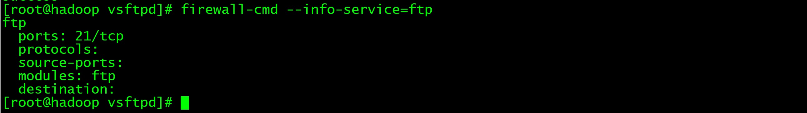
由`ftp`服务信息可知，光将ftp服务加入防火墙规则是没用的，除非将防火墙的服务信息改掉`/etc/firewalld/services/service.xml`和`/etc/firewalld/zones/public.xml`  
还是直接添加端口方便一些:  
```shell
# 添加ftp连接端口
firewall-cmd --zone=public --add-port=1369/tcp --permanent
# 添加ftp数据传输端口
firewall-cmd --zone=public --add-port=50000-51000/tcp --permanent 
# 刷新规则
firewall-cmd --reload
# 查看端口
firewall-cmd --list-ports
```
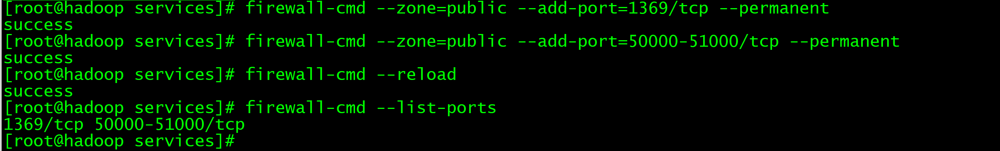

## 2.3 创建虚拟账号
在上述配置文件 `vsftpd.conf`中配置的虚拟账号是`vsftpd`，因此在启动`vsftpd`服务前，我们需要事先创建该账号
```shell
useradd vsftpd -d /home/vsftpd -s /sbin/nologin
```
## 2.4 PAM配置
### 2.4.1 创建虚拟用户数据库
```shell
# 先创建文件 /etc/vsftpd/login.txt，并在文件中加入虚拟用户信息，奇数行为用户名，偶数行为用户密码，创建好后使用如下命令生成虚拟用户数据库文件 /etc/vsftpd/login.db
db_load -T -t hash -f /etc/vsftpd/login.txt /etc/vsftpd/login.db
# 修改权限
chmod 600 /etc/vsftpd/login.db
# 数据库文件生成后，为安全起见，可以将 login.txt 删除
rm -f /etc/vsftpd/login.txt
```
### 2.4.2 修改/etc/pam.d/vsftpd 配置
在文件`/etc/pam.d/vsftpd`中加入如下内容并注释掉其他内容：
```shell
auth    required        pam_userdb.so db=/etc/vsftpd/login
account required        pam_userdb.so db=/etc/vsftpd/login
```
## 2.5 SELINUX 配置
临时关闭 SELINUX 功能
```shell
# 临时将 SELINUX 的值改为 permissive
setenforce 0
# 查看 SELINUX 的值
getenforce
```
永久关闭 SELINUX 功能， 需重启操作系统
```shell
# 打开配置文件 /etc/sysconfig/selinux , 修改配置项 SELINUX 为如下 ， 修改完成需要重启操作系统
SELINUX=disabled
```
## 2.6 启动vsftpd服务
```shell
systemctl start vsftpd.service
```
## 2.7 测试不同配置下的账号登录
### 2.7.1 先创建几个虚拟账号
```shell
# 打开文件 /etc/vsftpd/login.txt ， 并加入如下两个账号信息， up 账号用作只能上传文件的测试，down账号用于只能下载文件的测试
up
up123
down
down123
# 执行下面的命令，重新生成虚拟数据库
db_load -T -t hash -f /etc/vsftpd/login.txt /etc/vsftpd/login.db
```
### 2.7.2 测试 chroot_list 
```shell
# 创建本地账号 lisimeng
useradd lisimeng -d /home/lisimeng -s /bin/bash
```
**此时登录会出现 `500 OOPS: chroot` 错误**，因为并没有指定用户`lisimeng`的`local_root`选项，该选项默认值为`none`，可以`man vsftpd.conf` 查看
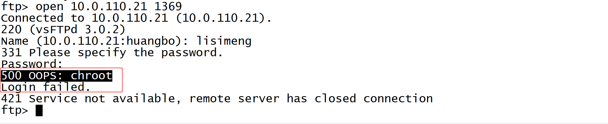
在`user_config_dir`配置的目录`/etc/vsftpd/user_conf`下添加配置文件 `lisimeng`，内容如下：
```properties
local_root=/home/lisimeng
```
**此时去连接`ftp`仍会报错，因为虚拟用户`vsftpd`对目录`/home/lisimeng`没有读权限**
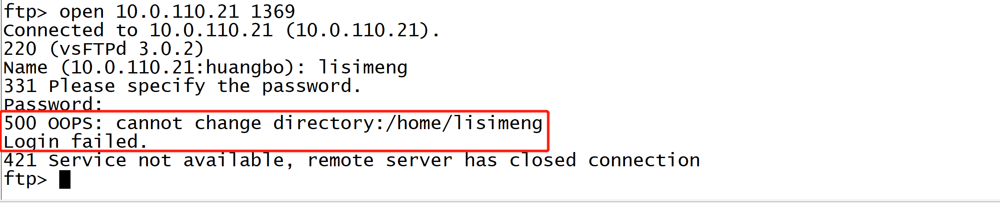
查看`/home/lisimeng`目录权限:

```shell
# 查看用户 lisimeng 的组信息
id lisimeng
# 将用户 lisimeng 的组修改为 vsftpd 组
usermod -g vsftpd lisimeng
# 修改目录 /home/lisimeng 的权限，对组用户添加读和执行权限
chmod g+rx /home/lisimeng
```
修改用户 `lisimeng` 的组信息和其家目录权限后：

**此时再进行`ftp`连接就没有问题了：**

**观察发现，我们配置的目录明明是 `/home/lisimeng` , 但是执行`pwd`时显示的却是`/`，为确认确实是在目录`/home/lisimeng`下，可以在该目录下创建一个文件，然后再执行`ls`命令** 
**至于为何会出现上述情况，是因为`chroot_list`配置文件, 因为用户`lisimeng`并没有加入`chroot_list`文件，因此其是没有离开`local_root`所指定目录的权限的.**
**如下图所示，即使`lisimeng`对目录`/data/lisimeng`具有完全权限，但是也不能切换过去：**
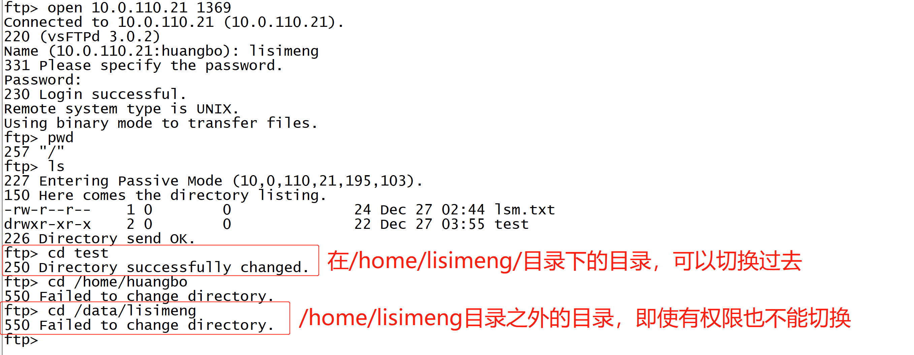
**配置`chroot_list`文件，将`lisimeng`加入进去，一个用户名占用一行，再连接`ftp`，这次就可以切换目录啦,并且首次登录进入的目录也能正确显示：**
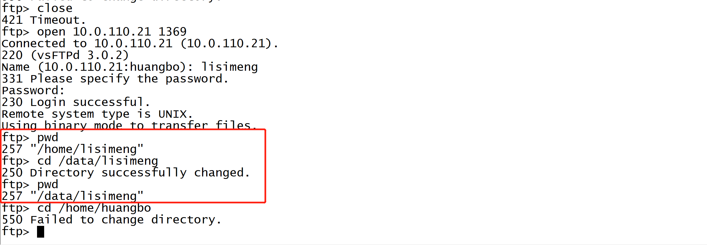

### 2.7.3 测试shell不在/etc/shells中的用户
安装一个机器上没有的shell , tcsh， 如果机器上有除了 sh , bash 之外的其他shell，不用安装也行，其他的shell还有很多：ksh, zsh, ash 等
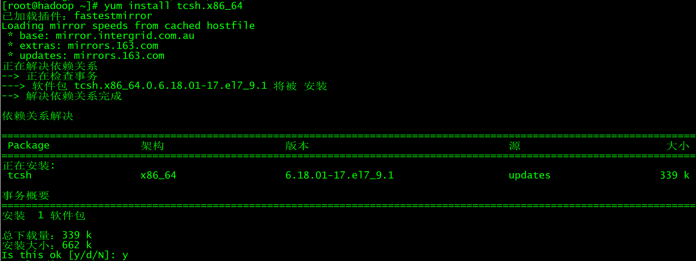
```shell
# 新建用户 ftp1 , 并指定登录 shell 为 tcsh
useradd ftp1 -d /home/ftp1 -s /bin/tcsh
# 查看 /etc/shells 文件，发现文件中多了两行: /bin/tcsh 和 /bin/csh, 我们注释掉 /bin/tcsh ， 即在这一行前面加上一个 '#' , 然后用 ftp1这个用户去连接ftp服务器
```
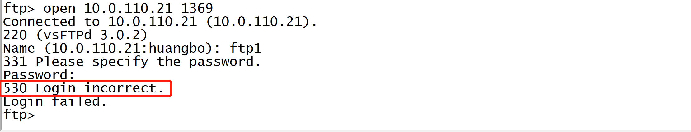
**去掉`/etc/shells`文件中的注释, 即放开 `/bin/tcsh` 这一行, 再进行`ftp`登录**  
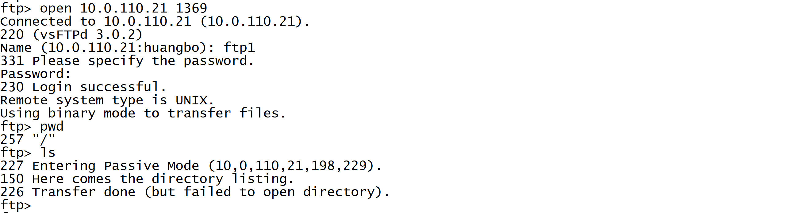  
**可以发现将`ftp1`的登录`shell`加入到`/etc/shells`文件中之后，便可以正常登录了，这里`ls`命令还有问题(出现错误：226 Transfer done (but failed to open directory).)是因为 `SELINUX` 处于开启状态, 可以使用通过命令`setenforce 0`来临时关闭`SELINUX`或者修改文件`/etc/sysconfig/selinux`, 将配置项改为`SELINUX=disabled`, 然后重启系统永久生效**  
同样可以测试**登录用户`shell`为 `/sbin/nologin`的账号**一样是**无法登录的**  
### 2.7.4 只能上传文件的账号
**配置账号 up , 限制该账号只能上传文件，不能切换出给其指定的根目录， 因此不要把该账号加入到 chroot_list 中去**  
在虚拟用户配置目录 /etc/vsftpd/user_conf 下创建虚拟用户同名文件 up , 并在文件中加入如下内容:
```shell
# 账号登录成功时的家目录，得事先创建好
local_root=/data/upload
# 允许写(全局)
write_enable=YES
# 关闭下载功能
download_enable=NO
```
创建目录 `/data/upload`
```shell
mkdir /data/upload
# 更改目录归属
chown -R vsftpd. /data/upload
```
测试连接：  
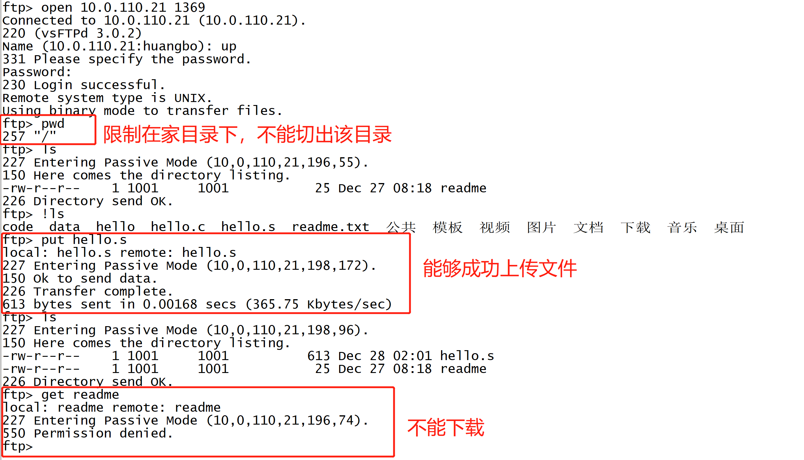
### 2.7.5 只能下载不能上传的账号
**配置账号down, 限制该账号只能下载文件，且不能切出其家目录**  
在虚拟用户配置目录 /etc/vsftpd/user_conf 下创建虚拟用户同名文件 down , 并在文件中加入如下内容:
```shell
# 账号登录成功时的家目录，得事先创建好
local_root=/data/download
# 不允许写(全局)
write_enable=NO
# 开启下载功能
download_enable=YES
```
创建目录 `/data/download`
```shell
mkdir /data/download
# 更改目录归属
chown -R vsftpd. /data/download
```
测试连接：  
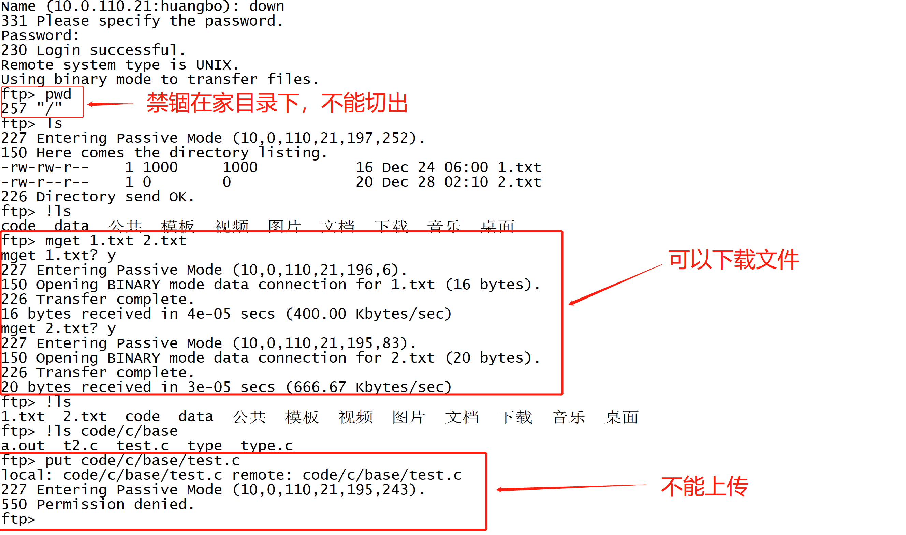  
# ftp的主动模式与被动模式
## 主动模式

在主动模式下，ftp客户端会给服务端的21端口发送ftp命令，告诉服务端我已打开自己的20端口，请向我的20端口发起TCP连接来传输文件，服务端接收到命令后，会主动向客户端的20端口发起连接，连接成功后开始传输文件。  
**注意：主动模式下，ftp请求是由客户端发起的，传输数据的时候TCP连接是由服务端发起的。**
## 被动模式

**在被动模式下，不管是ftp命令还是数据传输，都是由客户端向服务端发起TCP连接，服务端在接收到ftp命令后会打开一个空闲的高位端口。**  
在共享网络环境下，只能使用被动模式。因为主动模式需要服务端向客户端发起请求，而共享网络的客户端和服务端中间隔了个公网网关，服务端只能向公网地址的20端口发送请求，共享网络中设备的内部地址是无法收到这个请求的。  
# 海蒂与爷爷
  
