# VMWare WorkStation  虚拟机扩容
## 1. vmware 设置
先关闭要扩容的虚拟机  
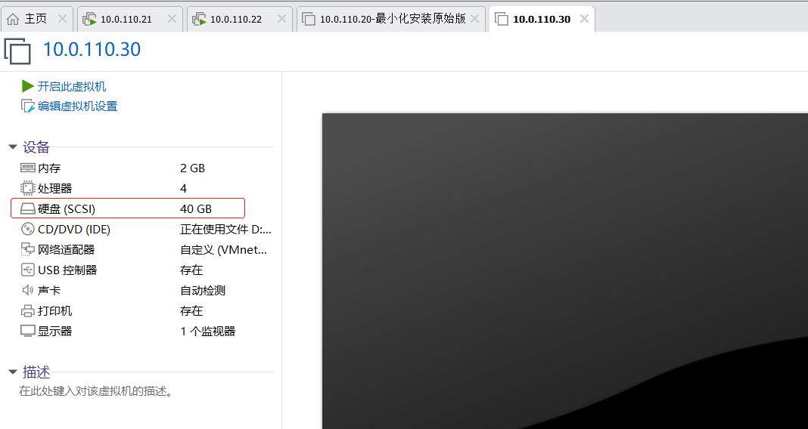  

例如要将机器 `10.0.110.30` 的硬盘从40G扩展到50G  
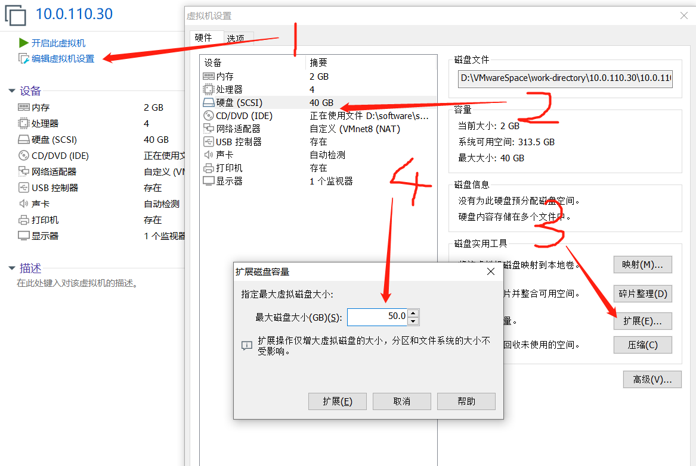  
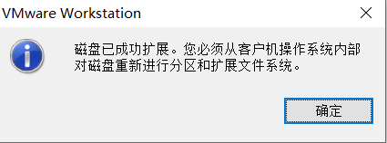  
## 2. 添加磁盘分区
vmware设置完毕后，开启该虚拟机, 切换为 `root` 身份以便进行磁盘操作  
运行命令`df -h` 查看，虽然虚拟机磁盘已经从40G扩展到了50G，但新增的那10G还处于不可用状态  
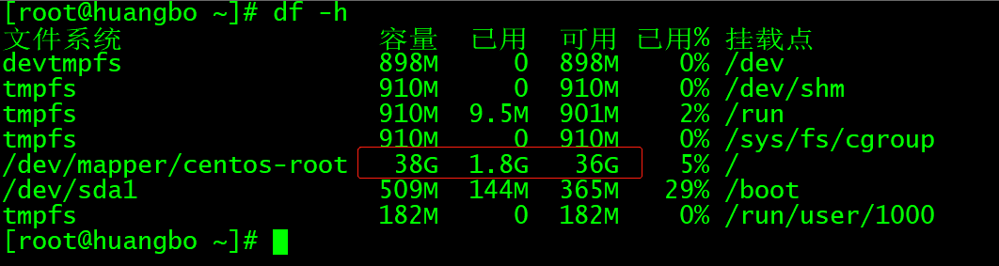  

`fdisk -l` 查看磁盘信息, 可以看到总的磁盘空间已经有 50G了  
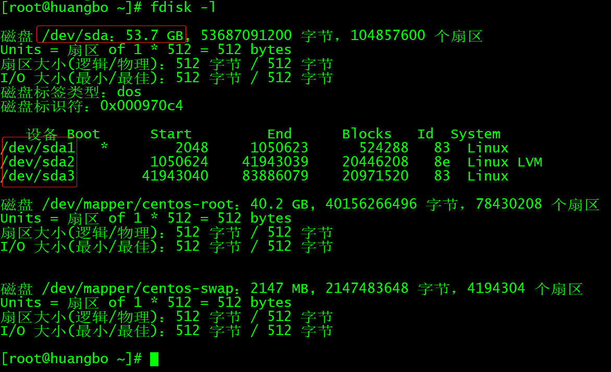   

`fdisk /dev/sda` 对新增的磁盘空间进行分区  
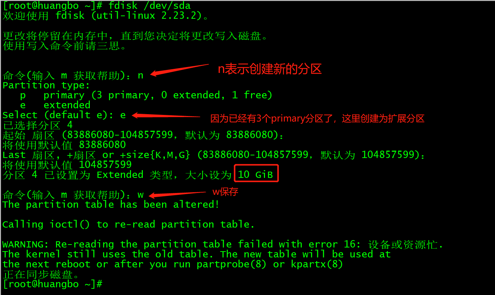  
**注意上图中的warning，虽然做了新的分区，但是当前分区表正在使用，为了系统安全，新的分区表将在reboot后生效**   
**如果创建分区的时候选择的是 p(primary) 分区，需要指定分区序号，一般会有提示，如果已经有3个了，就指定为 4**   
`fdisk -l` 再次查看磁盘信息，发现新创建的分区已经有了  
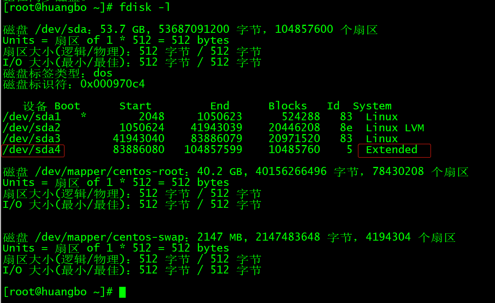  

**primary分区和extended分区最多只能有4个，其中extended分区最多1个，若是要分4个以上的分区，必须要有extended分区，剩下的磁盘空间都分配给extended分区，然后再以logical分区来规划extended空间**   

**extended分区并不能直接拿来格式化做文件系统，因此要在上面创建逻辑分区来使用 extended 分区**  
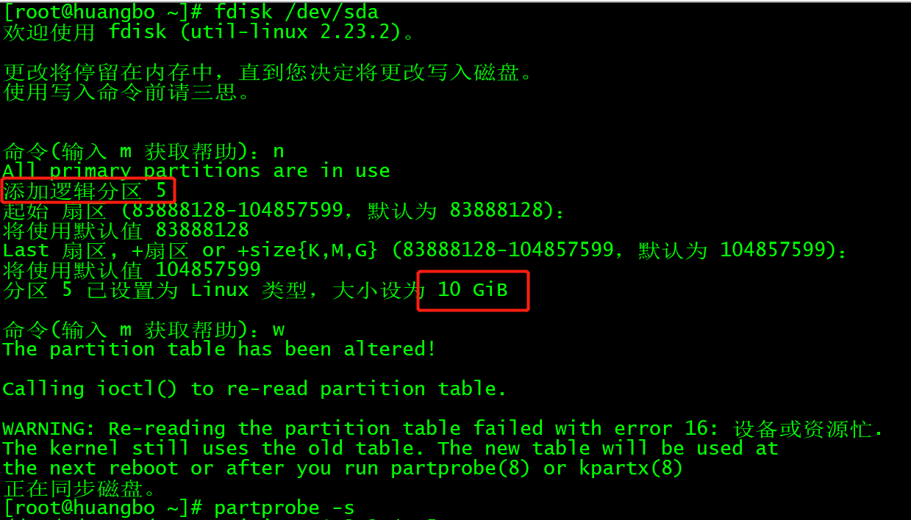   
使用`partprobe -s`刷新分区表后，查看磁盘信息  
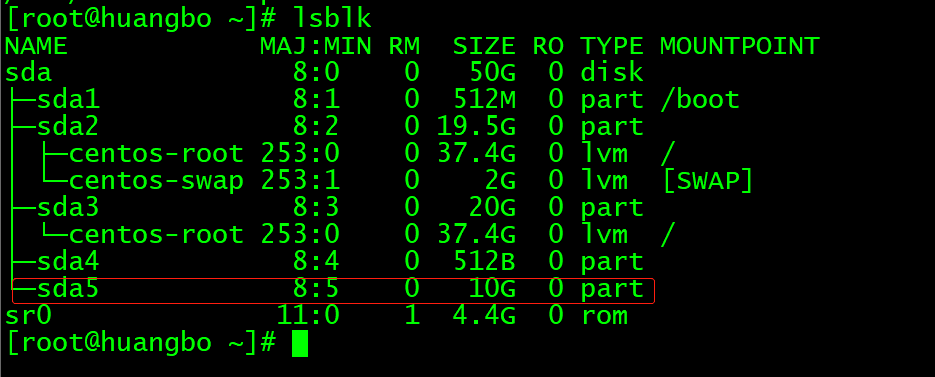   

使用`partprobe` 指令更新分区表信息，这样就不用重启啦 , 加上 -s 选项才会打印信息  
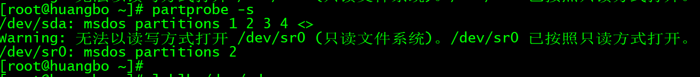  

如果想删除分区，可以使用 fdisk 的 d 指令  
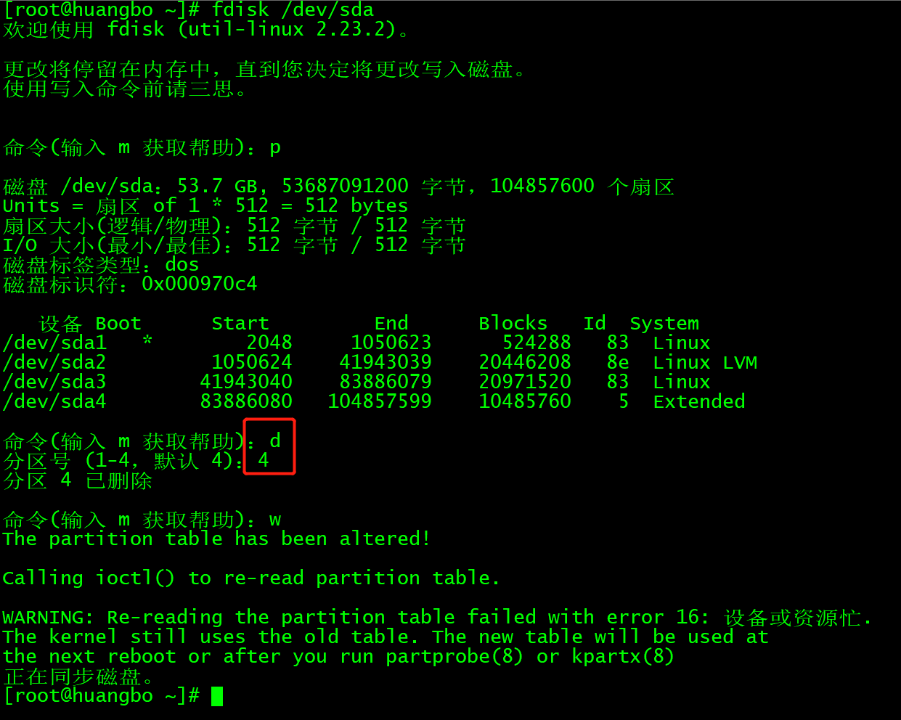  

同样也要使用了 `partprobe` 指令后，分区表才会更新  

## 3. 格式化分区为可挂载的文件系统 
格式化新创建的逻辑分区 `mkfs.xfs -f /dev/sda5` , 并使用 `blkid`指令查看分区  
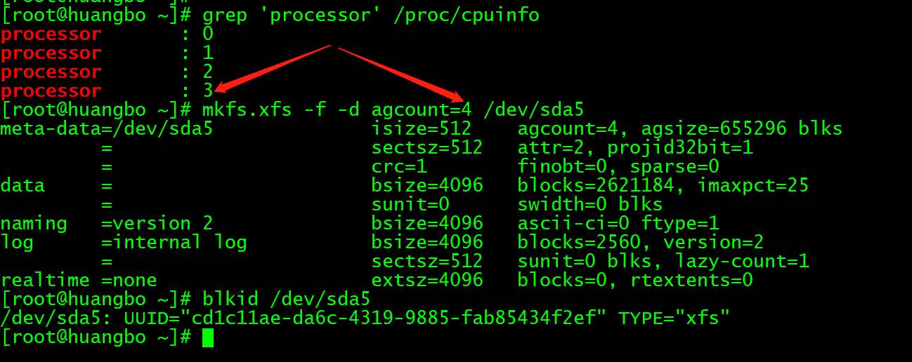   

## 4. 挂载文件系统
`mount -t xfs UUID='cd1c11ae-da6c-4319-9885-fab85434f2ef' /data`  
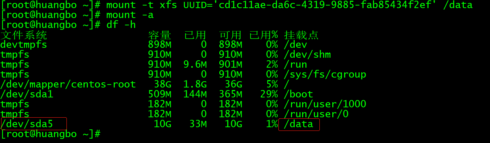  

