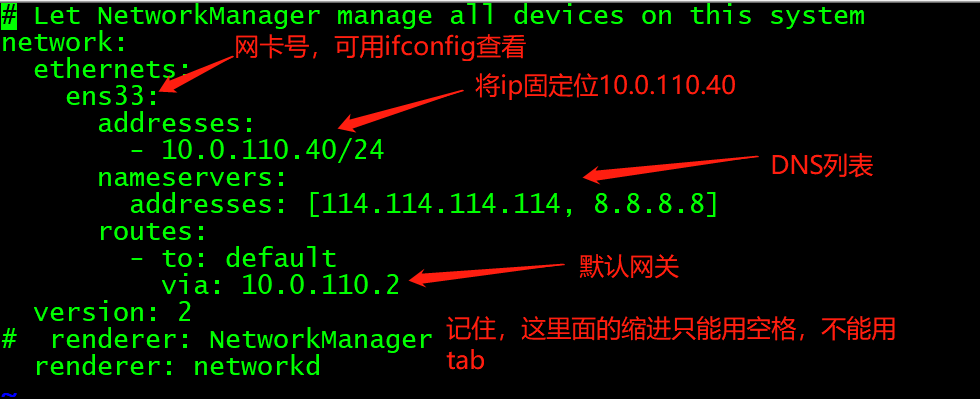
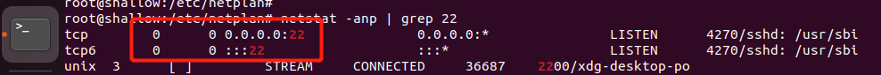
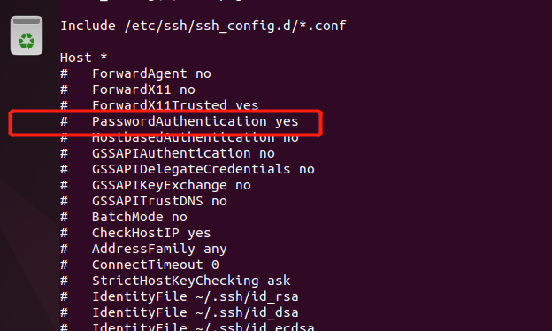
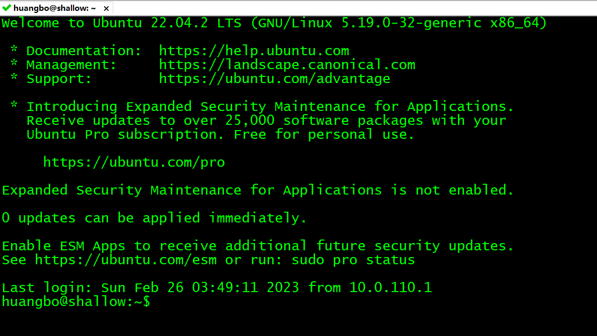

# 虚拟机安装
**安装选择自定义分区, 自定义分区时，需要额外多分2个区 Reserved BIOS boot area(10-100M, 最低1M) EFI System partition(300M)**

**ubuntu 安装完成，默认是不设置 root 用户的，在安装时设置的用户默认属于 sudo 用户，可以在终端使用`sudo passwd`来修改root密码，root密码每次登录都是随机的**

# vmware-tools 安装
由于版本原因，不一定能安装 vmware-tools .  这有可能是系统中有 open-vm-tools 的原因, 若是这个原因导致 vm-tools 安装失败, 可以如下操作:
先卸载 open-vm-tools 和 open-vm-tools-desktop
`sudo apt-get remove open-vm-tools open-vm-tools-desktop`
再重新安装
`sudo apt-get install open-vm-tools open-vm-tools-desktop`

# 替换镜像源
先备份原始文件 `/etc/apt/source.list`
`sudo mv /etc/apt/source.list /etc/apt/source.list.bak`
然后创建一个 /etc/apt/source.list , 写入如下内容:
```
deb https://mirrors.tuna.tsinghua.edu.cn/ubuntu/ jammy main restricted universe multiverse
# deb-src https://mirrors.tuna.tsinghua.edu.cn/ubuntu/ jammy main restricted universe multiverse
deb https://mirrors.tuna.tsinghua.edu.cn/ubuntu/ jammy-updates main restricted universe multiverse
# deb-src https://mirrors.tuna.tsinghua.edu.cn/ubuntu/ jammy-updates main restricted universe multiverse
deb https://mirrors.tuna.tsinghua.edu.cn/ubuntu/ jammy-backports main restricted universe multiverse
# deb-src https://mirrors.tuna.tsinghua.edu.cn/ubuntu/ jammy-backports main restricted universe multiverse
deb https://mirrors.tuna.tsinghua.edu.cn/ubuntu/ jammy-security main restricted universe multiverse
# deb-src https://mirrors.tuna.tsinghua.edu.cn/ubuntu/ jammy-security main restricted universe multiverse
```
更新 apt
`sudo apt update`


# 安装 net-tools
ubuntu系统默认是没有 net-tools 的，也就是像 `ifconfig` 这样的命令不可用
安装 net-tools
`sudo apt-get install net-tools`
若是说找不到合适的包，先做 apt-get update 再安装

# 配置静态IP
修改配置文件
```
# 这个配置文件名是根据系统和设置来的，不一定叫这个名字
vi /etc/netplan/01-network-manager-all.yaml
```
配置如下:
```
# Let NetworkManager manage all devices on this system
network:
  ethernets:
    ens33:
      addresses:
        - 10.0.110.40/24
      nameservers:
        addresses: [114.114.114.114, 8.8.8.8]
      routes:
        - to: default
          via: 10.0.110.2
  version: 2
#  renderer: NetworkManager
  renderer: networkd
```




# ssh 连接 ubuntu 虚拟机
若是本地机器和 ubuntu 虚拟机可以互通，但是不能进行 ssh 连接 
- 检查ubuntu机器是否安装了 ssh 服务
```shell
# 若没有发现监听22端口的进程，则说明没有安装
netstat -anp | grep 22
```
- 安装 ssh 
```shell
sudo apt-get install openssh-server
```
- 启动 sshd 服务
```shell
systemctl start sshd
```


一般安装完 ssh 服务，就可以连接服务器啦~ 若是还不行，可以检查下防火墙, 在防火墙中让 ssh 可以通信
```shell
# 查看防火墙状态
sudo ufw status
# 关闭防火墙
sudo ufw stop 
# 开启防火墙
sudo ufw start 
# 允许 ssh 通过防火墙
sudo ufw allow ssh 
```

**若经过以上步骤还是不能通过ssh连接服务器，那就是 ssh 设置禁用了账号密码登录**
```shell
# 查看ssh配置文件
sudo vi /etc/ssh/ssh_config
```
默认情况下，配置项 `PasswordAuthentication yes` 是注释掉的，将注释解开


**修改配置后, 重启 sshd 服务才能生效(systemctl restart sshd)**

终于连接上啦~



