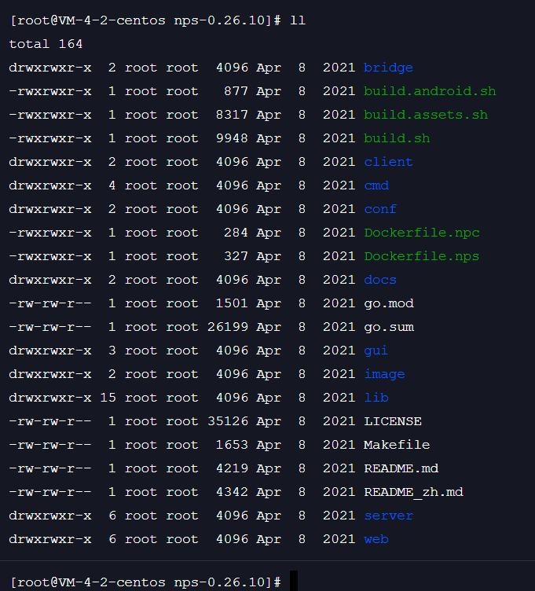

# 源码安装  
## 下载安装包
可以在 [github ehang-io/nps](https://github.com/ehang-io/nps/releases "nps/releases") 下载源码包进行安装, [中文文档](https://ehang-io.github.io/nps/#/?id=nps)  
将源码包上传至具有公网ip的服务器并解压  

  

## 环境准备  
## Go环境  
因为 nps 是使用 go 语言编写的，因此编译源码包需要**Go 编译器**  
进入[Golang官网](https://golang.google.cn/dl/) 下载与系统相应的安装包, 我这里选择**go1.20.1.linux-amd64.tar.gz**  

将go解压到`/usr/local`目录下, 配置环境变量    
```shell
# 在 ~/.bashrc 中配置， 配置完执行 source ~/.bashrc 使其生效  
export GOROOT=/usr/local/go
export PATH=$PATH:$GOROOT/bin
export GOPATH=/opt/code/go
```  

## 编译源码
> 编译源码前先修改 `Makefile`  
```
# 将 Makefile 中的 GOPROXY 设置为国内代理
# export GOPROXY := https://gocenter.ioc
export GOPROXY := https://goproxy.cn,direct
```  
> 修改 GOINSECURE  
设置从 **ehang.io** 下载的东西不进行证书校验  
`go env -w GOINSECURE="ehang.io"`  

> make  
```
make 
```  

## 安装  
编译完成后，会在目录下生成 nps 可执行文件  
```shell  
# 要以管理员身份运行
./nps install
```   

## 启动 nps 
nps install 后，nps命令就已经添加到环境变量里面去了，因此直接执行 nps 命令即可  
`nps start`  

## 访问web管理页面  
nps的web管理页面的默认启动端口是**8080**  
  

默认的登录名和密码为: `admin/123`  
登录后需要修改密码  
  

## 云服务器的web页面访问  
云服务器是没有桌面的，因此要想通过本地来访问服务器上的 nps 服务，需要在防火墙中开启 **8080** 端口访问规则  
  

  


# releases 包安装  
## 安装  
下载**linux_amd64_server.tar.gz**  
直接在服务器解压  
  

输入命令`./nps install` 进行安装  

## 启动  
`nps start`  


# 内网穿透  
## 新增客户端  
  

刷新客户端，可以看到客户端已经添加成功，但是现在还是离线状态  
  

## 配置客户端  
[下载客户端](https://github.com/ehang-io/nps/releases), 如果穿透目标机器是windows的，就下载windows的，如果目标是linux，就下载linux的  
我这里下载了**linux_amd64_client.tar.gz**  
解压，这里需要执行一条指令，可以去客户端查看  
  
  

拷贝指令到客户端执行:  
  

再刷新客户端，可以看到，客户端现在的状态已经是在线了  
  

## 端口映射  
将客户端的某些端口映射到服务器端，这样通过访问服务器对应的端口，就可以访问到客户端机器了  
  
  

## 测试  
客户端机器开启一个web服务  
  

现在通过第三台机器访问公网的映射端口  
  


