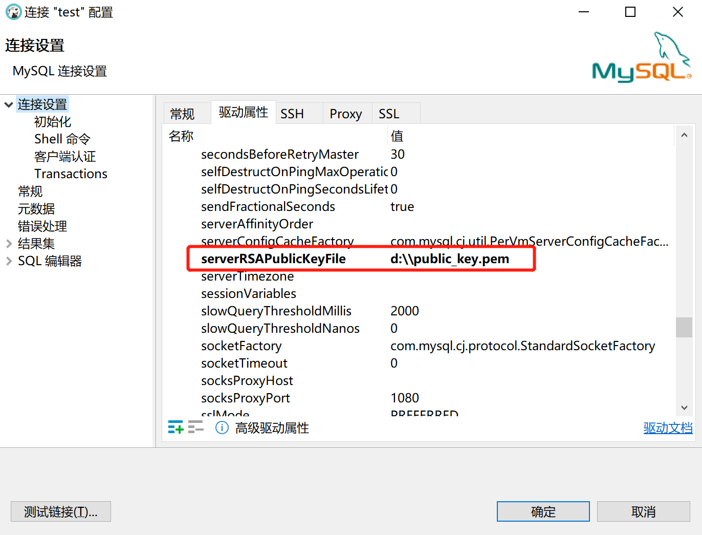

# mysql社区版安装
## 1. 使用yum进行安装
```shell
# 使用如下命令查找合适的安装源
yum search mysql | grep community
```
  
```shell
# 使用yum安装
yum install mariadb.x86_64
```
## 2. 使用rpm包进行安装  
使用rpm或者tar包进行安装需要先下载相应的安装文件，下载地址:  
[mysql-community](https://dev.mysql.com/downloads/mysql/ "mysql社区版下载地址")  
下载前，需要先选择对应的操作系统:  
  
下载rpm包：  
最好下载各种组件打包在一起的包:  
  
若需要选择组件进行安装，则他们之间是有依赖关系的，下面几个是必须要进行安装的：  
  
```shell
# 安装命令
# rpm安装会采用系统默认路径:
# 1. /etc/  --配置文件安装目录
# 2. /usr/bin --可执行文件安装目录
# 3. /usr/lib --函数库安装目录
# 4. /usr/share/doc -- 软件使用手册保存位置
# 5. /usr/share/man -- 帮助手册保存位置
rpm -ivh <包名>

# 查询已安装的包
rpm -qa | grep java

# 卸载已安装的包
rpm -e <包名>

# 升级
# -U：如果软件没有安装过则直接安装，若已安装则升级至最新版本
rpm -Uvh <包名>
# -F：若没有安装该软件则不会安装，只有安装了低版本的软件才会进行升级
rpm -Fvh <包名>
```

## 3. 使用tar包进行安装  
### 3.1. 下载安装包
[mysql-community](https://dev.mysql.com/downloads/mysql/ "mysql社区版下载地址")  
下载不包含测试组件的tar包即可：  
  
### 3.2. 环境准备
- 解压安装包  
```shell
tar -zxvf mysql-8.0.27-el7-x86_64.tar.gz
```
- 创建mysql用户和组  
```shell
groupadd mysql
useradd -r -g mysql -s /bin/false mysql
```
- 创建软连接
```shell
ln -s /opt/software/mysql/mysql-8.0.27-el7-x86_64 /usr/local/mysql
```
- 将mysql的bin目录添加至PATH
```shell
# 可以通过添加sh文件 /etc/profile.d/mysql.sh 来进行永久配置
# 在 /etc/profile 文件中配置也可以，安全起见，在 /etc/profile.d/ 目录下创建自己的配置文件进行配置会更好
# 查看 /etc/profile 脚本会发现，在执行/etc/profile脚本时会扫描并执行/etc/profile.d/目录下的所有.sh文件
export PATH=$PATH:/usr/local/mysql/bin
```
### 3.3. 配置
- 创建数据目录
```shell
mkdir /data/mysql
# 修改目录归属
chown -R mysql. /data/mysql
# 修改目录权限
chmod 750 /data/mysql
mkdir /data/mysql/mariadb
chown -R mysql:mysql mariadb
```
- 修改配置文件
```config
# 修改 /etc/my.conf
[mysqld]
basedir=/usr/local/mysql
datadir=/data/mysql
socket=/data/mysql/mysql.sock
port=3306
[mysqld_safe]
log-error=/data/mysql/mariadb/mariadb.log
pid-file=/data/mysql/mariadb/mariadb.pid
# 修改 /usr/local/mysql/support-files/mysql.server
basedir=/usr/local/mysql
datadir=/data/mysql
```
- 初始化数据目录
```shell
cd /usr/local/mysql
bin/mysqld --initialize --user=mysql
mkdir /data/mysql/mariadb
touch /data/mysql/mariadb/mariadb.log
touch /data/mysql/mariadb/mariadb.pid
chown -R mysql:mysql /data/mysql/mariadb
```
  
- 创建ssl/rsa文件  
```shell
bin/mysql_ssl_rsa_setup
```
### 3.4. 启动服务
- 添加mysql服务
```shell
cd /usr/local/mysql
cp support-files/mysql.server /etc/init.d/mysql.server
```
- 启动服务
```shell
mysqld_safe --user=mysql &
```
### 3.5. 连接服务
```shell
# 密码是初始化数据目录时的临时密码, -h 指定为 127.0.0.1 不要指定为 localhost 或者使用缺省值(localhost)
mysql -h 127.0.0.1 -u root -p
```
  
```shell
# 修改密码
alter user 'root'@'localhost' identified by 'admin123';
```
  
### 3.6. 远程连接
- 创建远程连接用户  
```sql
-- @'%'表示任意ip都可用, 若不指定@信息则默认为 @'%'
-- 亦可指定具体ip, 如 'huangbo'@'172.16.116.111' 表示只有在ip为'172.16.116.111'的机器上才能使用账号huangbo进行连接
create user 'huangbo'@'%' identified by '123456';
```
- 给用户授权
```sql
-- 授予所有权限
grant all privileges on *.* to 'huangbo';
-- 对某个数据库赋予所有权限(示例为 test 数据库),亦可指定某张具体的表
grant all privileges on test.* to 'huangbo'@'%';
-- 刷新权限
flush privileges;
--------------- 权限说明 ----------------
-- all privileges : 所有权限
-- select : 读权限 
-- delete : 删除权限
-- update : 更新权限
-- create : 创建权限
-- drop : 删除权限
```
- 在防火墙规则里添加连接端口
```shell
firewall-cmd --zone=public --add-port=3306/tcp --permanent
-- 刷新
firewall-cmd --reload
-- 查询
firewall-cmd --list-ports
```
**注意: mysql 8 如果启用sHA密码认证，密码在传输过程中使用TLS协议保护,若没有提供rsa公钥文件，连接的时候可能会报错 'Public Key Retrieval is not allowed'**  
- 解决方式
a. 修改连接属性，将`allowPublicKeyRetrieval`属性设置为 `TRUE`，为防止恶意代理通过MITM攻击获取到明文密码，该属性默认是 FALSE   
  
b. 指定公钥文件(奇怪的是这里只需要指定文件且文件存在即可，置于文件内容好像无关紧要？？有时间再仔细研究)  
  
