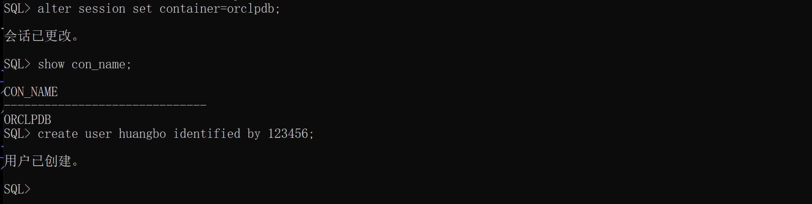

# Windows 下安装 oracle
## 1. 下载 oracle 安装包
从 [oracle_home](https://www.oracle.com/cn/index.html "oracle 官网") 上下载 oracle 安装包  

  
## 2. 安装
### 2.1 解压
解压下载下来的安装包，最好自己创建一个目录，解压到指定目录下，我这里以版本号创建了一个目录  
**注意：存放安装文件的目录最好不要包含中文和空格，否则后面安装的时候可能会出问题。**  
  
双击`setup.exe`开始安装  
### 2.2 图示安装步骤
  
安装类型选择：  
  
安装方式选择：  
  
安装版本选择：  
  
运行oracle服务的用户，在本地创建一个oracle专用用户或者使用虚拟账户：    
  
指定oracle基目录，注意最好使用**不含中文和空格**的目录路径：  
  
选择要创建的数据库类型：  
  
数据库标识符设置，若不想要容器数据库可将“创建为容器数据库”选项的`√`取消掉  
**注意：容器数据库和传统的oracle数据库使用上差别很大，若无 pdb 数据库使用经验，请不要使用可拔插数据库**
  
内存分配，使用默认值即可，若机器内存较小，可手动配置一个合理的值  
  
字符集选择，在 Windows 下最好选择 ZHS16GBK 字符集  
  
指定oracle数据文件存放目录，即DBF文件存放路径  
  
管理选项，直接下一步  
  
是否启用数据库恢复功能，若启用，需指定恢复存储区  
  
数据库账户口令设置，理论上各账户口令应分别设置，由于是个人使用，懒得记忆口令，这里就直接将所有口令设置为相同了  
  
安装概要文件，没有问题直接点击"安装"即可  
  
整个安装过程比较慢，大概20分钟左右, 安装完成会有个日志界面，检查有误错误即可  
  

## 3. 使用
- 查看 oracle 进程  
在 Windows 环境下，安装完成后，oracle 服务处于启动状态，可使用 `tasklist | findstr oracle` 查看服务进程信息  
  
- 查看监听  
```cmd
lsnrctl status
```  
  

- 以`sysdba` 身份登录  
```cmd
sqlplus "/as sysdba"
```
  
- 关闭数据库
```sql
shutdown immediate
```
  
- 关闭监听
```cmd
lsnrctl stop
```  
  
- 修改配置文件 listener.ora
```
# D:\software\oracle\19.3\network\admin\listener.ora, 在文件的 SID_LIST_LISTENER 中加入如下内容:
(SID_DESC =
		(GLOBAL_NAME = ORCL)
		(ORACLE_HOME = D:\software\oracle\19.3)
		(SID_NAME = ORCL)
	)
	(SID_DESC =
		(GLOBAL_NAME = ORCLPDB)
		(ORACLE_HOME = D:\software\oracle\19.3)
		(SID_NAME = ORCL)
	)
```
  
- 修改配置文件 tnsnames.ora
```
# D:\software\oracle\19.3\network\admin\tnsnames.ora, 在文件中加入如下内容:
ORCL =
  (DESCRIPTION =
    (ADDRESS = (PROTOCOL = TCP)(HOST = DESKTOP-IOUK5DQ)(PORT = 1521))
    (CONNECT_DATA =
      (SERVER = DEDICATED)
      (SERVICE_NAME = orcl)
    )
  )

ORCLPDB =
	(DESCRIPTION =
		(ADDRESS = (PROTOCOL = TCP)(HOST = DESKTOP-IOUK5DQ)(PORT = 1521))
		(CONNECT_DATA =
		  (SERVER = DEDICATED)
		  (SERVICE_NAME = orclpdb)
		)
	)
```
  

- 启动监听
```cmd
lsnrctl start
```  
  
- 启动数据库
```sql
# 以 syddba 身份连接数据库
sqlplus /nolog
conn /as sysdba
# 启动数据库
startup
```  
  
- 查看 pdb 数据库
```sql
show pdbs;
```
  
- 开启 pdb 数据库
```sql
-- 发现 pdb 数据库 orclpdb 状态是 MOUNTED , 将其打开
alter pluggable database orclpdb open;
-- 查看其状态，可发现 open mode 变成 read write 了
show pdbs;
```
  

- 创建用户  
若使用的是容器数据库，刚登录的时候所处位置是根容器，在根容器下不能创建本地用户，只能创建公共用户，公共用户名称强制要求以`c##`开头，否则会报"ORA-65096: 公用用户名或角色名无效"的错误  
  
要创建本地用户，需要先切换至某个具体的 pdb 数据库(可拔插数据库)  
```sql
-- 查看可拔插数据库
select pdb_name, status from dba_pdbs;
show pdbs;
-- 切换 pdb
alter session set container=orclpdb;
-- 查看当前容器名称
show con_name;
-- 创建用户
create user huangbo identified by 123456;
```  
  
- 给用户授权
```sql
grant connect,resource,dba to huangbo;
```
- 用新建用户连接数据库  
  

- sqlplus 直连数据库
```cmd
sqlplus huangbo/123456@orclpdb
```
  
## 4. 入库 
- 查询表空间信息、添加数据文件  
```sql
-- 查询当前用户所属表空间
SELECT default_tablespace FROM DBA_USERS WHERE USERNAME ='HUANGBO';
-- 查询表空间使用情况
SELECT 
	UPPER(F.TABLESPACE_NAME) "表空间名",     
	D.TOT_GROOTTE_MB "表空间大小(M)",     
	D.TOT_GROOTTE_MB - F.TOTAL_BYTES "已使用空间(M)",     
	TO_CHAR(ROUND((D.TOT_GROOTTE_MB - F.TOTAL_BYTES) / D.TOT_GROOTTE_MB * 100,2),'990.99') "使用比",     
	F.TOTAL_BYTES "空闲空间(M)",     
	F.MAX_BYTES "最大块(M)"    
FROM (
	SELECT 
		TABLESPACE_NAME,     
		ROUND(SUM(BYTES) / (1024 * 1024), 2) TOTAL_BYTES,     
		ROUND(MAX(BYTES) / (1024 * 1024), 2) MAX_BYTES     
	FROM 
		SYS.DBA_FREE_SPACE     
	GROUP BY 
		TABLESPACE_NAME
) F, (
	SELECT 
		DD.TABLESPACE_NAME,     
		ROUND(SUM(DD.BYTES) / (1024 * 1024), 2) TOT_GROOTTE_MB     
	FROM 
		SYS.DBA_DATA_FILES DD     
	GROUP BY 
		DD.TABLESPACE_NAME
) D     
WHERE 
	D.TABLESPACE_NAME = F.TABLESPACE_NAME     
ORDER BY 4 DESC
; 
-- 给表空间添加数据文件, 这里添加了约 30GB 的表空间数据文件
ALTER TABLESPACE USERS ADD datafile 'D:\software\app\huangbo\oradata\ORCL\USERS02.DBF' SIZE 30720M;

-- 创建数据目录
CREATE OR REPLACE directory data_dir AS 'D:\data\oracle';
-- 查询目录信息
SELECT * FROM dba_directories;
-- 若目录需要给其他用户使用，还需要对目录给指定用户授权
GRANT READ,WRITE ON directory data_dir TO HUANGBO;
```  
- 数据导入
对于 dmp 文件的导入，有两种情况:
1. dmp文件是使用 exp 命令导出的， 这个时候需要使用 imp 命令进行导入
2. dmp文件是使用 expdp 命令导出的，这个时候需要使用 impdp 命令进行导入, impdp和expdp 命令必须在数据目录下进行操作
**<oracle就是麻烦，不可否认很难用，虽然各种问题都有成熟的解决方案，但是太麻烦了>**

# Linux 安装 oracle
## 1. 下载并解压安装包
**本来想写的，但是使用了一下oracle后，又放弃了，不到万不得已是不会选择oracle的，等什么时候实在闲的无聊的时候再补上吧**  

