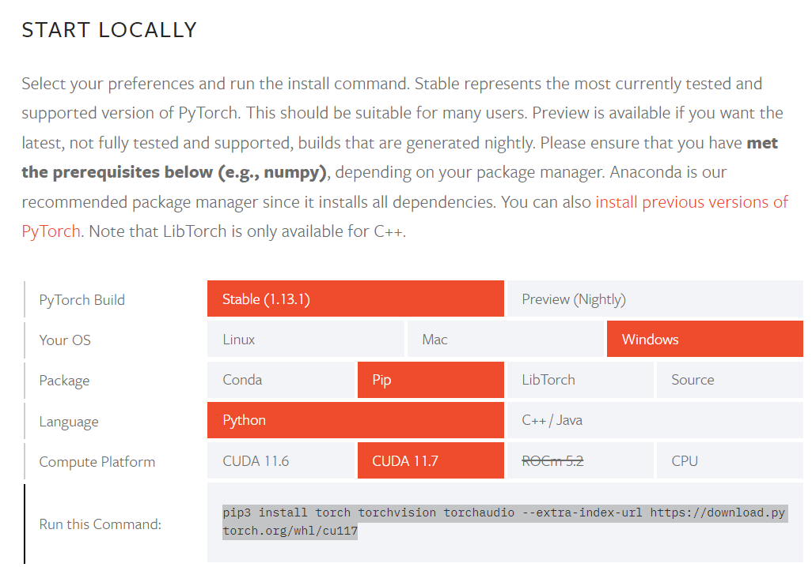
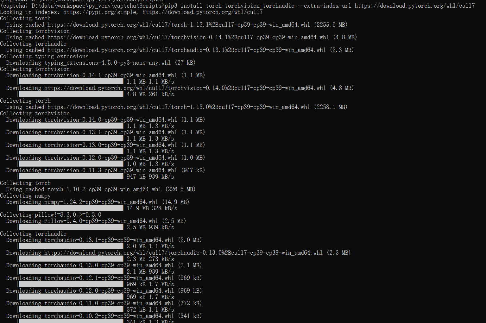

# 使用pip安装pytorch
安装pytorch前，需要先安装CUDA
去[pytorch官网](https://pytorch.org/get-started/locally/#windows-pip) 选择pytorch版本、操作系统、安装使用的工具、语言、CUDA版本等，就会生成相应的命令. 比如我使用pip安装，会生成如下指令:
`pip3 install torch torchvision torchaudio --extra-index-url https://download.pytorch.org/whl/cu117`

安装pytorch要下载的东西会比较多，建议在网络情况较好的时候进行

